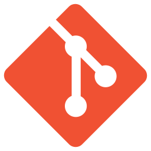

# What is Git?

## What is Version Control?

Version Control is a file tracking system with the following functionality.

!!! row ""
	
	!!! col-half ""
		
		1. Co-Development 
			* Multiple developers modify project files simultaneously and independently
			* Each developer has their own instance of the project files
		2. Synchronization
			* All modifications amongst developers are merged and any potential conflicts are resolved
		3. Revision History
			* Modifications to project files by any developer are logged and time-stamped
	
	!!! col-half ""
		
		{: style="margin-left:25px; width:275;" }

## The History of Git

!!! row ""
	
	!!! col-half ""
		
		* Began in 2005
			* Linus Torvalds & the Linux community
		* Goals
			* Free and open-source
			* Speed
			* Simple
			* Non-linear development
			* Fully distributed
		* Windows
			* You are using "Git for Windows"
			* Windows Vista and newer
	
	!!! col-half ""
		
		!!! row ""	
			
			!!! col-third ""
				
				{: style="width:100px" }
				{: style="width:100px" }
				{: style="width:100px" }
			
			!!! col-two-thirds ""
				
				[git-scm.com](https://git-scm.com){: .external-link }  
				[git-scm.com/docs](https://git-scm.com/docs){: .external-link }  
				[git-scm.com/book/en/v2](https://git-scm.com/book/en/v2){: .external-link }  
				[git-scm.com/downloads/guis](https://git-scm.com/downloads/guis){: .external-link }  
				
				    
				
				[gitforwindows.org](https://gitforwindows.org/){: .external-link }  
				[GitHub Wiki](https://github.com/git-for-windows/git/wiki){: .external-link }  
				[GitHub FAQ](https://github.com/git-for-windows/git/wiki/FAQ){: .external-link }  

## Terminology

!!! row ""
	
	!!! col-half ""
		
		* Git
			* Available 3-letter word amongst Unix commands
			* Global Information Tracker (not really)
		* VCS
			* <b>V</b>ersion <b>C</b>ontrol <b>S</b>ystem
			* DVCS - Distributed Version Control System
		* SCM
			* <b>S</b>oftware <b>C</b>onfiguration <b>M</b>anagement
			* Software Change Management
			* Source Code Management
			* Supply Chain Management
			* You pick one!
		* SVN
			* [Subversion (Apache)](https://subversion.apache.org/){: .external-link } - A Centralized Version Control System
	
	!!! col-half ""
		
		{: style="width:100%" }
		
		* CVS
			* [Concurrent Versions System](http://www.nongnu.org/cvs/){: .external-link } - A Centralized Version Control System
		* TFS
			* [Team Foundation Server (Microsoft)](https://azure.microsoft.com/en-us/services/devops/){: .external-link } - A Centralized Version Control System
			* Now called [Azure DevOps Server](https://docs.microsoft.com/en-us/azure/devops/server/tfs-is-now-azure-devops-server?view=azure-devops){: .external-link } with Git repositories available

## The Evolution of Version Control

Generation 		| Network 		| Content Operations 	| Synchronization 		| Example Software
----------------|---------------|-----------------------|-----------------------|--------------------
First 			| None 			| Single file 			| Locks 				| RCS, SCCS
Second 			| Centralized 	| File trees 			| Update before commit 	| CVS, SVN, Visual SourceSafe, TFS
Third 			| Distributed 	| Changesets 			| Commit before merge	| Git, Mercurial, BitKeeper, Bazaar

*See Eric Sink's* [*History of Version Control*](https://ericsink.com/vcbe/html/history_of_version_control.html){: .external-link }.

## Version Control Repository Definitions

* File System
	* Files, directories, size, type, date
* Repository
	* Snapshots of a file system over time
* File tree
	- Store complete files from each snapshot

{: style="margin-left:25px; width:100%" }

* Changeset
	- Store files changes between each snapshot

{: style="margin-left:25px; width:100%" }

# Git Mechanisms

## Distributed vs. Centralized (Git vs. SVN)

!!! row ""
	
	!!! col-half ""
		
		### Git - DVCS
		
		* Fully distributed, parallel programming
		* Local repository for offline development
		* Good large project performance
		
		{: style="width:95%" }
	
	!!! col-half ""
		
		### SVN - Centralized VCS
		
		* Straightforward commands
		* Rigid history
		* Good large file performance
		
		{: style="width:95%" }

*See Michael Ernst's* [*Version Control Concepts and Best Practices*](https://homes.cs.washington.edu/~mernst/advice/version-control.html#Distributed_and_centralized_version_control){: .external-link }

## Mechanism Definitions

There are five mechanisms that complete the full functionality of Git's version control

* Three mechanisms (**Workspace**, **Local**, and **Remote**) are required for fundamental Git commands
* The remaining two mechanisms (**Stash** and **Index**) prove useful in many scenarios, though can be dismissed when performing basic commands

{: style="width:100%" }

## Basic Commands

Here's a look at some fundamental Git commands across the five Git mechanisms.

{: style="width:100%" }

*See Andrew Peterson's* [*Visual Git Cheatsheet*](https://ndpsoftware.com/git-cheatsheet.html){: .external-link }