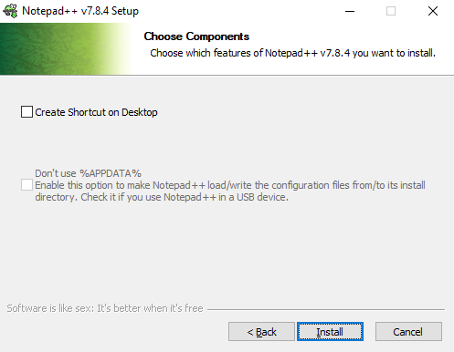

# Overview

This section provides installation details on the recommended software to start using Git for Windows.

As the **bare minimum**, you will need Git. An installer is available on Git's official website.

- [git-scm.com/downloads](https://git-scm.com/downloads){: .external-link }
	- The web page should automatically recognize you are using Windows, so simply click the link *Download <version> for Windows* to get the latest stable version.
- The Git for Windows installation provides:
	- Use of the `git`{: .code-snippet } command from the Windows Command Prompt
	- Git-Bash - A shell terminal on Windows
	- Git-GUI - A simple GUI for repositories
	- OpenSSH - Secure Shell Protocol utility
	- OpenSSL - Library for secure communications with HTTPS websites

*More details on the actual installation to follow.*

It is **recommended** to additionally download the follow **free** software to use with Git for Windows.

- A text editor
	- [Notepad++](https://notepad-plus-plus.org/){: .external-link }
	- [Atom](https://atom.io/){: .external-link } - Also has a Git client integration
	- [Sublime Text](https://www.sublimetext.com/){: .external-link }
	- [Microsoft VSCode](https://code.visualstudio.com/){: .external-link }
- A SSH Client
	- [PuTTY](https://putty.org/){: .external-link } - A user friendly SSH client for Windows
- A Git GUI client
	- [TortoiseGit](https://tortoisegit.org/download/){: .external-link }
	- [Sourcetree](https://www.sourcetreeapp.com/){: .external-link }
	- [GitHub Desktop](https://desktop.github.com/){: .external-link }
	- [Sublime Merge](https://www.sublimemerge.com/){: .external-link }
	- [GitKraken](https://www.gitkraken.com/){: .external-link }

# Install Notepad++

{: style="width:222px; float:right;" }

Notepad++ is a fast and lightweight text editor for Windows, useful for editing source code and configuration files. It is free to download from the official website [https://notepad-plus-plus.org/](https://notepad-plus-plus.org/){: .external-link }. Find the latest version (32 or 64 bit) and download the installer.

Installing Notepad++ before Git will allow you to reference the existing Notepad++ installation during the Git installation.

Run the installer and accept User Account Control.

 

#### 0. Language {: .collapsible }

{: style="width:288px; display:block; margin-left:auto; margin-right:auto; border:1px solid gray;" }

#### 1. Welcome {: .collapsible }

{: style="width:497px; display:block; margin-left:auto; margin-right:auto; border:1px solid gray;" }

#### 2. License Agreement {: .collapsible }

{: style="width:497px; display:block; margin-left:auto; margin-right:auto; border:1px solid gray;" }

#### 3. Install Location {: .collapsible }

{: style="width:497px; display:block; margin-left:auto; margin-right:auto; border:1px solid gray;" }

#### 4. Components {: .collapsible data-show="1" }

!!! Step ""
	
	{: style="width:497px; display:block; margin-left:auto; margin-right:auto; border:1px solid gray;" }
	
	- The default component selections are sufficient
	- Make sure *Context Menu Entry* is selected (default)
		- This helps for quick edits of text files

#### 5. Options {: .collapsible }

{: style="width:497px; display:block; margin-left:auto; margin-right:auto; border:1px solid gray;" }

#### 6. Finish {: .collapsible }

{: style="width:497px; display:block; margin-left:auto; margin-right:auto; border:1px solid gray;" }

# Install PuTTY

[PuTTY](https://putty.org/){: .external-link } is a client program for the SSH (Secure Shell) protocol. It will be used to communicate file changes to repositories on a server. It is free, open source, and available to download for Windows and Unix systems at the [author's website](https://www.chiark.greenend.org.uk/~sgtatham/putty/latest.html){: .external-link } or [ssh.com](https://www.ssh.com/ssh/putty/download){: .external-link }.

The PuTTY installation will be referenced during the Git installation process.

Download the 32 or 64 bit installer, then run the installer with the default options.

#### 1. Welcome {: .collapsible }

{: style="width:492px; display:block; margin-left:auto; margin-right:auto; border:1px solid gray;" }

#### 2. Destination Folder {: .collapsible }

{: style="width:492px; display:block; margin-left:auto; margin-right:auto; border:1px solid gray;" }

#### 3. Feature Options {: .collapsible data-show="1" }

!!! Step ""
	
	{: style="width:492px; display:block; margin-left:auto; margin-right:auto; border:1px solid gray;" }
	
	- Keep *Put install directory on the PATH ...* selected (default)
		- This will add `C:\Program Files\PuTTY`{: .code-snippet } to your Windows PATH allowing other programs to find it
		- Use this command to view all current directories in your PATH with cmd (Credit Groosha at [Stack Overflow](https://stackoverflow.com/a/15885269/11402416){: .external-link })
	
	\> echo %path:;=&echo.%
	{: .code-block style="margin-left:80px" }
	
#### 4. Complete {: .collapsible }

{: style="width:492px; display:block; margin-left:auto; margin-right:auto; border:1px solid gray;" }

# Install Git

With Notepad++ and PuTTY installed, it is now a good time to install Git. If installed out of order, that is fine, you can still make changes to Git's configuration after installation.

### Installation Options

The default Git installation options will work fine on Windows, but there are a few recommended alternative options that align with the remaining material in the tutorial. These alternative options can also be implemented after installation.

### Already Installed?

If you already have Git installed, you can still run the latest installer. This will effectively update your current installation of Git. The installation options will populate based on your current Git configuration and you can modify them during the *update* installation.

### Download and Install

Download the 32 or 64 bit version of Git from the official website [git-scm.com](https://git-scm.com/download/win){: .external-link } and run the installer.

Steps marked *Configurable*{: style="color:rgba(90,80,255,0.9);" } can be configured post-installation.

#### 1. Information {: .collapsible }

!!! Step ""
	
	{: style="width:463px; display:block; margin-left:auto; margin-right:auto; border:1px solid gray;" }

#### 2. Destination Location {: .collapsible }

!!! Step ""
	
	{: style="width:463px; display:block; margin-left:auto; margin-right:auto; border:1px solid gray;" }

#### 3. Select Components {: .collapsible data-show="1" }

!!! Step ""
	
	{: style="width:463px; display:block; margin-left:auto; margin-right:auto; border:1px solid gray;" }
	
	- The default component selections (shown) are sufficient
	- It is recommended to keep the **Git Bash Here** Windows Explorer integration checked for quick access to bash commands

#### 4. Start Menu {: .collapsible }

!!! Step ""
	
	{: style="width:463px; display:block; margin-left:auto; margin-right:auto; border:1px solid gray;" }

#### 5. Text Editor *Configurable*{: style="color:rgba(90,80,255,0.9);" } {: .collapsible }

!!! Step ""
	
	{: style="width:463px; display:block; margin-left:auto; margin-right:auto; border:1px solid gray;" }
	
	- The default selection is Vim only for historical reasons
	- It is recommended to use the already installed and user-friendly **Notepad++** text editor
	- This default editor is launched when running `git commit`{: .code-snippet } without a message argument, prompting for a message

#### 6. PATH Environment {: .collapsible }

!!! Step ""
	
	{: style="width:463px; display:block; margin-left:auto; margin-right:auto; border:1px solid gray;" }
	
	- The recommended selection (2nd, default) is the best option
		- This option only adds the necessary entries to PATH allowing Git commands from:
			- Windows Command Prompt (cmd)
			- Windows Powershell
			- Git Bash
		- Unix commands will only be available from Git Bash with this option
		- Adds `C:\Program Files\Git\cmd\`{: .code-snippet } to the system PATH environment
	- The third options adds the following to the system PATH environment ([ojchase from Stack Exchange](https://superuser.com/a/1427480/1093302){: .external-link })
		- `C:\Program Files\Git\cmd\`{: .code-snippet }
		- `C:\Program Files\Git\mingw64\bin\`{: .code-snippet }
		- `C:\Program Files\Git\usr\bin\`{: .code-snippet }
	
#### 7. SSH Agent *Configurable*{: style="color:rgba(90,80,255,0.9);" } {: .collapsible data-show="1" }

!!! Step ""
	
	{: style="width:463px; display:block; margin-left:auto; margin-right:auto; border:1px solid gray;" }
	
	- Git ships with OpenSSH (default) as the Secure Shell (SSH) protocol client.
		- However, all of OpenSSH's tools are command line execution only. This can be difficult for new users.
	- [PuTTY](#install-putty) has a suite of user-friendly graphical interface applications to perform SSH client operations.
	- This step of the installation is looking for the executable of a remote connection tool.
		- Plink (PuTTY Link) can be found from any of the following installations:
			- `C:\Program Files\PuTTY\Plink.exe`{: .code-snippet } - Already installed [above](#install-putty)
			- `C:\Program Files\TortoiseGit\bin\TortoiseGitPlink.exe`{: .code-snippet }
			- `C:\Program Files\TortoiseSVN\bin\TortoisePlink.exe`{: .code-snippet }
	
#### 8. SSL Backend *Configurable*{: style="color:rgba(90,80,255,0.9);" } {: .collapsible }

!!! Step ""
	
	{: style="width:463px; display:block; margin-left:auto; margin-right:auto; border:1px solid gray;" }
	
	- The default selection is suitable for most cases, *especially when using SSH to connect with remote servers instead of HTTPS*.
	
#### 9. File Checkout *Configurable*{: style="color:rgba(90,80,255,0.9);" } {: .collapsible }

!!! Step ""
	
	{: style="width:463px; display:block; margin-left:auto; margin-right:auto; border:1px solid gray;" }
	
	- On checkout, Git will convert unix-style line endings (line feed LF) to windows-style line endings (carriage return CR line feed LF) for text-based files.
	- During a commit, the inverse is performed.
	- This is the recommended option for Windows compatibility.
	
#### 10. Terminal {: .collapsible }

!!! Step ""
	
	{: style="width:463px; display:block; margin-left:auto; margin-right:auto; border:1px solid gray;" }
	
	- To avoid complications (ASC-II, scroll-back) with the Windows Command Prompt, it is recommended to use MinTTY (default) as the terminal emulator for Git Bash.
	
#### 11. Extra Options *Configurable*{: style="color:rgba(90,80,255,0.9);" } {: .collapsible data-show="1" }

!!! Step ""
	
	{: style="width:463px; display:block; margin-left:auto; margin-right:auto; border:1px solid gray;" }
	
	- Each option can be enabled or disabled post-installation.
	- The Git Credential Manager (stores HTTPS connection usernames and passwords) is unnecessary when utilizing SSH for remote connections.
	
#### 12. Complete {: .collapsible }

!!! Step ""
	
	{: style="width:463px; display:block; margin-left:auto; margin-right:auto; border:1px solid gray;" }
	
	{: style="width:463px; display:block; margin-left:auto; margin-right:auto; border:1px solid gray;" }
	
	Git has now successfully been installed on your computer.

# Install TortoiseGit

TortoiseGit is a free and open source Windows software to interface with Git.

Specifically, TortoiseGit is a lightweight Windows Shell Interface to Git making it very easy to use with all commands directly available from the Windows Explorer.
It is based on the TortoiseSVN interface for [Apache's Subversion](https://subversion.apache.org/){: .external-link } version control system.

Additionally, TortoiseGit provides helpful tools for file comparison and merging.
It works independently of all IDE (Integrated Development Environment) applications

TortoiseGit is available for download on its [official website](https://tortoisegit.org/download/){: .external-link }
Download and run the latest stable installer for your 32 or 64 bit system.

#### 1. Welcome {: .collapsible }

!!! Step ""
	
	{: style="width:492px; display:block; margin-left:auto; margin-right:auto; border:1px solid gray;" }
	
#### 2. Information {: .collapsible }

!!! Step ""
	
	{: style="width:492px; display:block; margin-left:auto; margin-right:auto; border:1px solid gray;" }
	
#### 3. SSH Client {: .collapsible data-show="1" }

!!! Step ""
	
	{: style="width:492px; display:block; margin-left:auto; margin-right:auto; border:1px solid gray;" }
	
	- TortoiseGitPlink is TortoiseGit's adoption of [PuTTY](#install-putty){: .external-link }'s Plink.
	- You may use `TortoiseGitPlink.exe`{: .code-snippet } or `Plink.exe`{: .code-snippet } for Git operations. However, PuTTY provides additional tools for SSH connections which prove useful for many scenarios.
	
#### 4. Custom Setup {: .collapsible }

!!! Step ""
	
	{: style="width:492px; display:block; margin-left:auto; margin-right:auto; border:1px solid gray;" }
	
	All subfeatures are selected by default and take up little space.
	
#### 5. Ready to Install {: .collapsible }

!!! Step ""
	
	{: style="width:492px; display:block; margin-left:auto; margin-right:auto; border:1px solid gray;" }
	
#### 6. Complete {: .collapsible }

!!! Step ""
	
	{: style="width:492px; display:block; margin-left:auto; margin-right:auto; border:1px solid gray;" }
	
Once installed, TortoiseGit prompts the user to run the First Start Wizard. This is highly recommended to complete the setup of TortoiseGit before usage.

Steps marked *Configurable*{: style="color:rgba(90,80,255,0.9);" } can be configured post-installation.

#### 1. Language {: .collapsible }

!!! Step ""
	
	{: style="width:470px; display:block; margin-left:auto; margin-right:auto; border:1px solid gray;" }
	
#### 2. Details {: .collapsible }

!!! Step ""
	
	{: style="width:470px; display:block; margin-left:auto; margin-right:auto; border:1px solid gray;" }
	
#### 3. Git Path {: .collapsible }

!!! Step ""
	
	{: style="width:470px; display:block; margin-left:auto; margin-right:auto; border:1px solid gray;" }
	
#### 4. User Configuration *Configurable*{: style="color:rgba(90,80,255,0.9);" } {: .collapsible data-show="1" }

!!! Step ""
	
	{: style="width:470px; display:block; margin-left:auto; margin-right:auto; border:1px solid gray;" }
	
	Git's user configuration will be setup in the next page so the reader can see how to set, modify, and unset the user name and email in the Git configuration.
	
#### 5. Authentication and Credential Store *Configurable*{: style="color:rgba(90,80,255,0.9);" } {: .collapsible data-show="1" }

!!! Step ""
	
	{: style="width:492px; display:block; margin-left:auto; margin-right:auto; border:1px solid gray;" }
	
	- Similar to the Git installation, the credential store is unnecessary since it is recommended to use SSH for all remote connections.
	- Selecting a credential helper will not interfere with any SSH setup.
	- The credential helper configuration can be change at any time.